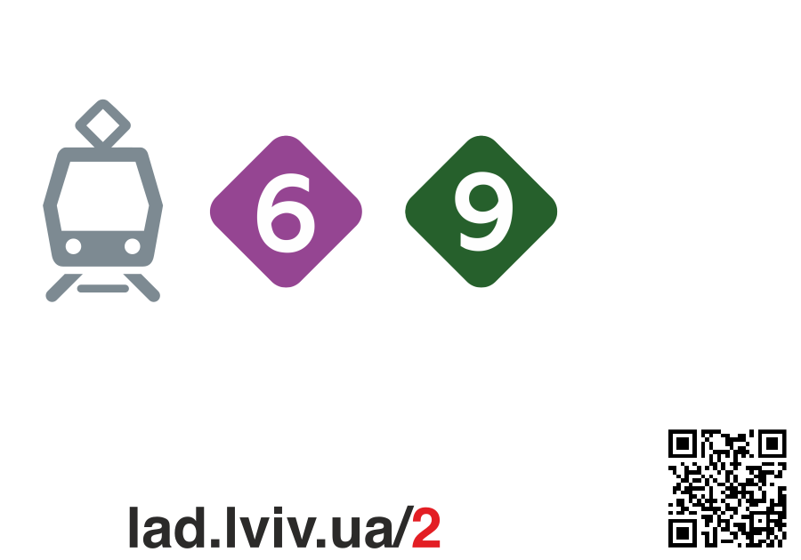
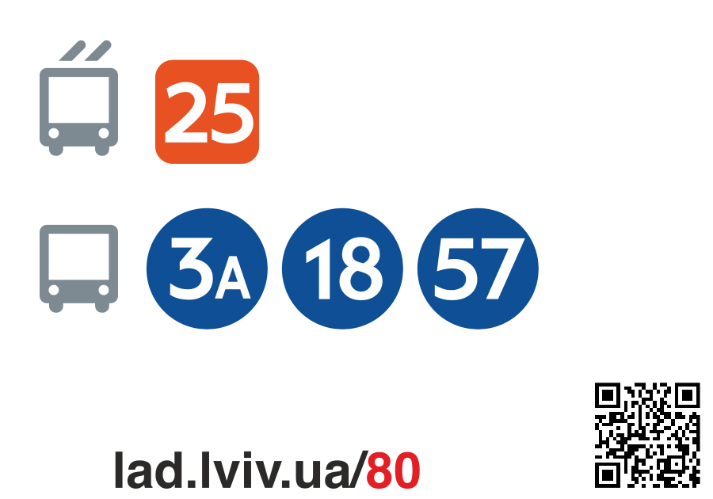
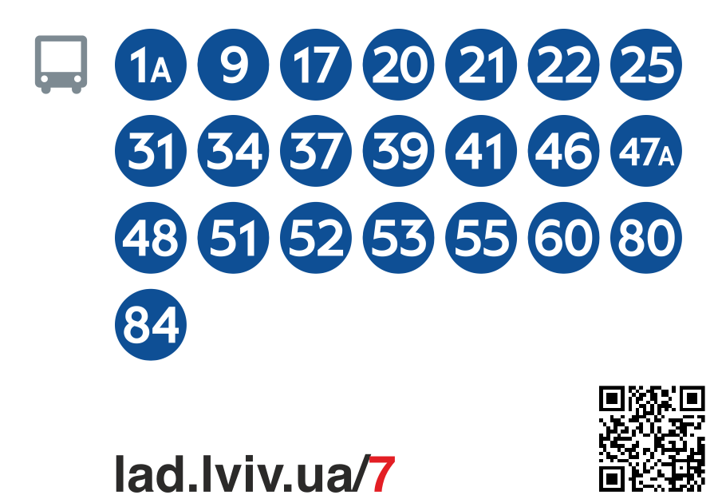
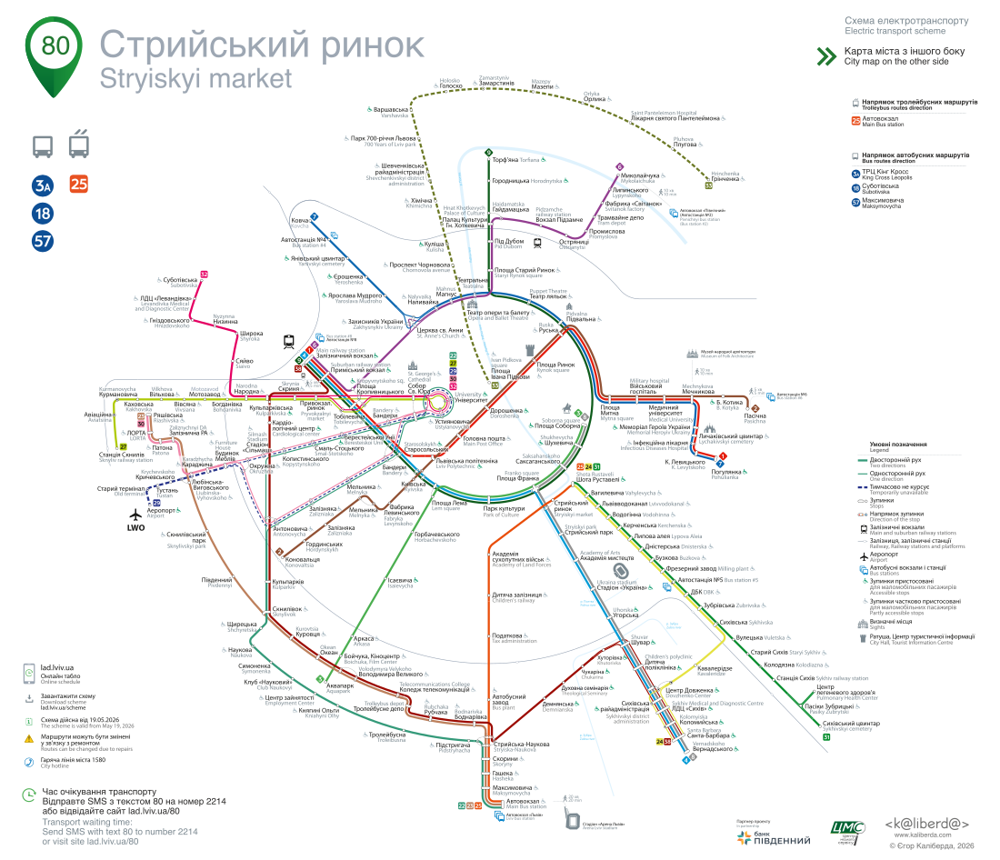

# 🚋 timetable-offline

**Printable stop stickers for Lviv public transport.** Give it a stop code, get back an SVG you can send straight to a printer and glue to a pole.

[](https://www.ruby-lang.org/)
[](https://sinatrarb.com/)
[](https://cloud.google.com/run)
[](http://www.wtfpl.net/)

🔗 Live at **[offline.lad.lviv.ua](https://offline.lad.lviv.ua/80)** · data from **[api.lad.lviv.ua](https://api.lad.lviv.ua)**

---

## 📸 What it makes

Every sticker is generated on the fly, no design tool involved. The layout is picked automatically from how many routes actually stop there.

### `GET /:code` — the stop sticker

<table>
  <tr>
    <td align="center" width="33%">
      <br>
      <b><code>/2</code></b> · Площа Старий Ринок<br>
      <sub>2 trams → <code>layout-3</code></sub>
    </td>
    <td align="center" width="33%">
      <br>
      <b><code>/80</code></b> · Стрийський ринок<br>
      <sub>3 buses + 1 trolleybus → <code>layout-8</code></sub>
    </td>
    <td align="center" width="33%">
      <br>
      <b><code>/7</code></b> · Проспект Чорновола<br>
      <sub>22 buses → <code>layout-28</code></sub>
    </td>
  </tr>
</table>

🎨 Vehicle type is encoded in the badge shape, not just colour — 🔷 diamond for trams, ⭕ circle for buses, ▫️ rounded square for trolleybuses. The QR code points back at the live timetable for that stop.

### `GET /:code/schema` — the whole network, with you-are-here

<p align="center">
  
</p>

A bilingual 8386×7205 map of the city's electric transport, with the current stop pinned in the corner and its routes listed. Printed on the back of the sticker.

### `?only=` / `?add=` / `?remove=` — fixing up the route list

Upstream data lags reality, so both routes take three optional comma-separated params:

```
/80?add=A46,T02&remove=T03,A47
/80?only=A18,A57
```

`only` is the whole route list, in the order written — names the API lists for the stop keep their upstream data, names it does not are built from the name alone, and everything else is dropped. The three are applied in order: `only`, then `remove`, then `add`. Names are matched after normalisation, so `A47`, Cyrillic `А47` and `47` all mean the same route; a route the stop already has is never added twice, and a name that is not a plain badge (`t2`, `47a`, `airport`) is ignored. Vehicle type of an added route comes from its prefix — `Т`/`T` trolleybus, `А`/`A` bus, `Н`/`N` night, bare digits tram — and its destination is left blank, because the API only names end stops for routes it says serve the stop.

---

## 🧠 How it works

```
GET /80
  │
  ├─ 🌐  fetch https://api.lad.lviv.ua/stops/80/static   (3s connect, 8s read)
  ├─ 🚌  bucket routes into tram / trolleybus / bus / night
  ├─ 📐  detect_layout → 3, 8 or 28 (how many types, how many routes)
  ├─ 🔳  render a QR code for lad.lviv.ua/80
  └─ 🖨️  ERB-render views/layout-N.erb  →  image/svg+xml
```

There is no database and no build step. Fonts are base64-embedded into the SVG, and every route badge in `public/icons/` is a hand-made file, so the output is one self-contained document that prints identically anywhere.

### Layout picking

| Layout | When | Capacity |
|---|---|---|
| `layout-3` | one vehicle type, ≤3 routes | 3 badges in a row |
| `layout-8` | one or two types, ≤8 routes, ≤4 per type | 2 rows of 4 |
| `layout-28` | everything else | 7 columns × 4 rows |

Beyond `layout-28`'s grid the icons would collide with the QR block, so indexes are clamped rather than allowed to run off the canvas.

---

## 🏃 Running it

```bash
make up
```

Regenerates `Gemfile.lock` in `ruby:3.1-alpine`, builds the production image, then brings it up with docker-compose on **http://localhost:4567**.

Bare Ruby works too, if you have 3.1 around:

```bash
bundle install && ruby app.rb
```

### 🧪 Tests

```bash
make test
```

Runs RSpec inside `ruby:3.1-alpine`, the same image production uses. The suite stubs the upstream API with WebMock, so it needs no network.

### 🚀 Deploy

```bash
make deploy
```

Builds `linux/amd64`, pushes to `gcr.io/timetable-252615/timetable-offline`, and rolls the new image out to Cloud Run — then prints the service URL and the revision that ended up live. Pushing the image alone does **not** deploy it; the service keeps serving its current revision until `gcloud run deploy` runs.

Roll back to a previous revision:

```bash
gcloud run services update-traffic timetable-offline --project timetable-252615 --region us-central1 --to-revisions REVISION_NAME=100
```

---

## 🗂️ Layout of the repo

| Path | What's in it |
|---|---|
| `app.rb` | The whole application — two routes, layout picking, route-name normalisation |
| `views/layout-{3,8,28}.erb` | Sticker templates, one per density |
| `views/scheme.erb` | The full network map |
| `views/{header,footer,fonts}.erb` | Shared partials, including the base64 font blobs |
| `public/icons/` | 148 hand-made SVGs — 141 route badges (`t25.svg`, `47a.svg`, …) plus the vehicle glyphs |
| `eng_names.rb` | Fallback English stop names, for the handful the API has no translation for |
| `as_pdf.rb` | Ad-hoc script that batch-renders stickers to PDF via wkhtmltopdf |
| `spec/` | RSpec suite |

### 🔤 Route name normalisation

Route names arrive in Cyrillic and have to map onto icon filenames. `А03` → `a03` → `a3` → `3` → `3a.svg`; `Т25` → `t25.svg`; `Аеропорт` → `airport.svg`. The rules live in `normalize_route_name`, and every route the API currently serves resolves to a real file. `?only=`/`?add=`/`?remove=` match on the same normalised name.

---

## 📜 License

[WTFPL](http://www.wtfpl.net/) — do what the fuck you want to.

Two things in this repo are **not** covered by that, because they were never mine to relicense:

- 🗺️ The network map in `views/scheme.erb` is © Єгор Каліберда, 2020 ([kaliberda.com](https://www.kaliberda.com)), as credited in the artwork itself.
- 🔠 The embedded Myriad Pro fonts in `public/fonts/` are Adobe's, under their own license.
